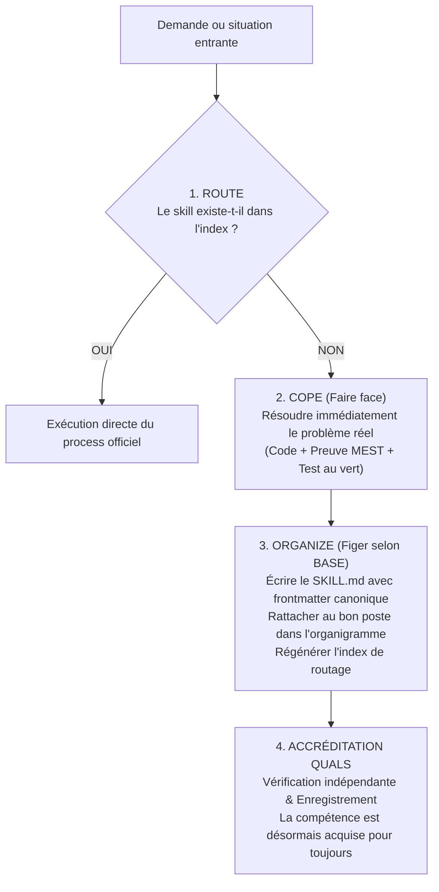

# Amélioration Constante — Route ➔ Cope ➔ Organize (amelioration-constante)

## La Règle Suprême
> **« Aucun agent ne travaille dans le vide. »**  
> Si un agent résout un problème complexe ou découvre une méthode efficace, cette connaissance ne doit **jamais** disparaître à la fermeture du terminal. Elle doit être injectée dans l'organisme vivant sous forme de `SKILL.md` standardisé.

---

## Le Cycle en 4 Temps

---

## Protocole Opérationnel

### Étape 1 : ROUTE d'abord
Consulter `.ai/routing/index.md` (ou exécuter `node .ai/base.mjs route "<demande>"`).
- Si une fiche couvre la demande : l'ouvrir et exécuter.
- Si aucune fiche ne couvre la demande : ne pas abandonner, passer à l'Étape 2.

### Étape 2 : COPE (Faire face sans bloquer l'humain)
1. Analyser les faits réels du disque (fichiers existants, logs, tests).
2. Concevoir la solution minimale et efficace.
3. Prouver la solution par un test automatisé ou une capture d'écran vérifiable.
4. **Interdiction** : Ne pas attendre une permission bureaucratique pour résoudre l'incident technique. Agir sur le réel.

### Étape 3 : ORGANIZE (Standardiser selon BASE)
Immédiatement après avoir validé le fix ou la production :
1. **Créer le `SKILL.md`** dans le dossier du poste concerné (`.ai/agents/<agent>/skills/processes/<slug>/SKILL.md`).
2. **Respecter la structure minimale `base.resource.v1`** :
   - `id`, `title`, `description`, `use_when`, `routing.examples`, `routing.avoid_when`.
   - `scope: team`, `status: active`, `sensitivity: internal`.
   - Étapes claires, VFP non ambigu, pièges historiques à éviter, preuves exigées.
3. **Mettre à jour l'`AGENT.md`** : Inscrire la nouvelle procédure dans son catalogue de compétences.
4. **Régénérer la carte** : `node .ai/base.mjs build routing-index --write --root .`

### Étape 4 : ACCRÉDITER (Quals / Division 5)
1. Vérifier que la nouvelle fiche passe la validation BASE : `node .ai/base.mjs validate --root .`
2. Soumettre la preuve au relecteur/client pour acceptation définitive.
3. La flotte entière bénéficie désormais de cette nouvelle capacité.
