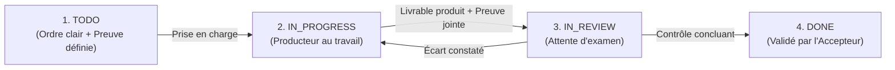

# Conduite de Projet par Preuve MEST — Bim-Bam-Boom (gestion-projet-bim-bam)

## VFP (Produit Final de Valeur)
Un registre de tâches net, où chaque tâche terminée est prouvée de visu, acceptée par un relecteur distinct du producteur, sans aucune discussion subjective ni dérive de statut.

---

## Les 4 Champs Stricts d'un Ticket (Rien de plus, rien de moins)

Chaque ticket ou tâche doit obligatoirement tenir dans ce gabarit :

```markdown
### [ID-TICKET] : [Titre précis avec verbe d'action]
- **Producteur**  : [Nom de l'opérateur ou de l'agent qui fabrique]
- **Accepteur**   : [Nom du relecteur/client distinct qui valide]
- **Preuve MEST** : [Critère d'acceptation observable de visu]
- **Statut**      : [TODO | IN_PROGRESS | IN_REVIEW | DONE]
```

### Exemple Concret :
```markdown
### JVMB-068 : Forfait unique couvre un bien pour la personne qui paie
- **Producteur**  : Nemish (Opérateur)
- **Accepteur**   : Miguel (Client) / Shiwam (Contrôle)
- **Preuve MEST** : Phrase affichée sur l'accueil, sur le bouton de paiement et dans l'espace propriétaire après login.
- **Statut**      : DONE (validé par Miguel le 2026-09-29)
```

---

## Les 4 Statuts Immuables & Leurs Règles de Transition



1. **TODO ➔ IN_PROGRESS** :
   - L'opérateur s'assigne le ticket. Zéro ticket « orphelin » en cours.
2. **IN_PROGRESS ➔ IN_REVIEW** :
   - L'opérateur termine le travail et **fournit obligatoirement la preuve** (lien d'aperçu, screenshot, résultat de commande, test unitaire).
   - **Interdiction formelle** de passer en `IN_REVIEW` sans attacher la preuve.
3. **IN_REVIEW ➔ DONE** :
   - **L'accepteur seul** valide le ticket après avoir constaté la preuve de ses propres yeux.
   - Le producteur ne peut **jamais** s'auto-valider en `DONE` (Principe de la Triade Division 5).
4. **IN_REVIEW ➔ REJET (Retour IN_PROGRESS)** :
   - Si la preuve ne correspond pas à la réalité, l'accepteur rejette le ticket en notant le **Vrai Why** (l'écart exact constaté).

---

## Le Registre Unique de Projet (`TASKS.md`)

Chaque dépôt client ou projet maintient son fichier `TASKS.md` à la racine :
- **Section 1 : En Cours (IN_PROGRESS / IN_REVIEW)** — 3 à 5 tâches prioritaires maximum.
- **Section 2 : À Venir (TODO)** — La file d'attente classée par urgence.
- **Section 3 : Terminés Récents (DONE)** — Historique daté avec liens de preuve.

---

## Passerelle de Communication kChat (routage-communication-kchat)

Pour que les tickets vivent dans la réalité opérationnelle et ne restent pas des lettres mortes :

1. **Ticket assigné (`TODO` ➔ `IN_PROGRESS`)** :
   - Notifier l'opérateur dans son **canal privé kChat** (`Opérateur 3..6`, `Shiwam`, `Ankit`) avec le format de mission standard (en anglais).
2. **Livrable soumis (`IN_PROGRESS` ➔ `IN_REVIEW`)** :
   - Notifier l'accepteur (ex: Miguel sur `Corrections Jevendsmonbien` ou Jacky sur `Décisions Founder`) avec le lien de preuve MEST directe.
3. **Ticket bloqué (`BLOCKERS/`)** :
   - Acheminer immédiatement la question fermée ou la demande d'arbitrage dans le canal approprié via le skill `routage-communication-kchat`. Zéro blocage silencieux.

---

## Miroir Cockpit NocoDB (pm.yourquantix.com)
Les tickets et corrections Git sont automatiquement projetés dans le cockpit NocoDB YourQuantix (`https://pm.yourquantix.com`) via le connecteur MCP / robot de synchronisation. Les opérateurs et le client n'ont aucune double saisie à faire : Git reste l'unique source de vérité immuable (`source_sha`), et NocoDB reflète l'état en temps réel pour consultation et validation.

Plus jamais de carnet de 300 lignes où personne ne sait qui fait quoi.
Bim. Bam. Boom.
